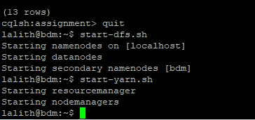
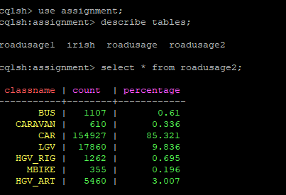
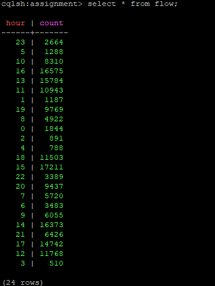
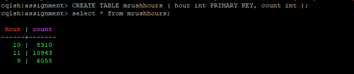
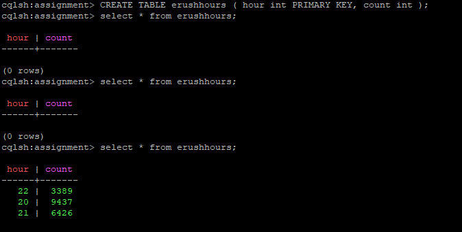
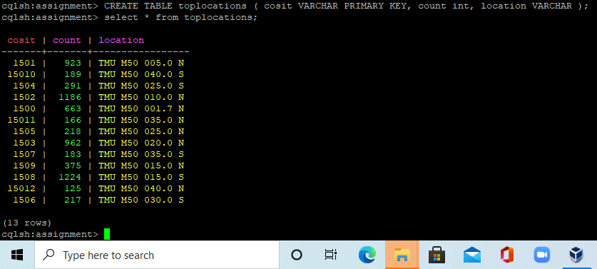

#  Off-line Processing of M50 Data using Apache Spark's SQL 

I have prepared a batch layer(Off-line processing pipeline) of the lambda architecture that enables to perform some analytics on M50 Highway data for answering same question like previous excercise but using Apache Spark's SQL API instead of DataFrame. I have prepared cassandra structures and the spark code that saves the computed batch views into these structures.


## Description of Dataset

Dataset is about M50 Highway Traffic data. I have acquired it from Transport Infrastructure Ireland (TII) (https://www.tii.ie) that operates and maintains a network of trafc counters on the motorway, national primary and secondary road networks in Ireland.

These traffic counters capture data on diferent parameters. There are currently around 400 of these counters active across the network. For an interactive view of the data they capture, go to the TII Trafc Counter Data Website: (https://www.nratrafficdata.ie)

The traffic counter data set is a valuable source of information on vehicle movements across the national road network and is made available
publicly in its raw form The frst row of each fle contains headers which describe each feld. However, the meaning of some of these may not be apparent to consumers.

The following explains some of the less obvious column headers:
* cosit: The unique identifier for the traffic counter device. In conjunction with the site’s dataset, this can be used to determine the location and route of the counter, used to record the vehicle movement.
* lane: The Id of the lane in which the movement was recorded, which is specific to each counter.
* straddlelane: If a value is present, this indicates that the vehicle may have been changing lanes as it passed over the counter.
* class/classname: This indicates the category of vehicle that was recorded e.g. car, bus, etc.
* length: The approximate length of the vehicle recorded.
* headway: The approximate distance between the front of the recorded vehicle and the vehicle behind.
* gap: The approximate distance between the rear of the vehicle and the front of the vehicle behind.
* weight: This is available on (Weigh-in-Motion) WIM sites only and indicates the approximate weight of the vehicle.
* temperature: If available, this indicates the approximate surface temperature of the road at the location of the device.
* numberofaxles: This is available on WIM sites only and indicates the number of axles detected for the vehicle.
* axleweights: This is available on WIM sites only and expresses as an array of real numbers, the weight over each axel in order.
* axlespacing: This is available on WIM sites only and expresses as an array of real numbers, the distance between each of the axles.


The data is updated and published daily, one day in arrears. The traffic counters on average generate over 4 million records for each day. The aggregated data from all trafc counters is a very large multi-terabyte dataset. Without doubt this is a big data management problem.

#### Set up
I have setup hadoop on ubuntu VM in Pseudo Distributed Operation (for storing the data in HDFS) and Apache Spark.
I have Installed Jupyter Notebook linked with PySpark. 

### Execution

Importing all sparkcontext, sparkconf,sparksession from pyspark 


```python
from pyspark import SparkContext, SparkConf 
from pyspark.sql import SparkSession
sc = SparkContext.getOrCreate();
spark=SparkSession.builder.getOrCreate()
ss= spark
```

### 1) Loading the csv file from the Hdfs file system

Loading the csv file from hdfs requires the hadoop services to be started.




```python
vehicle_records_DF = spark.read.csv("hdfs://localhost:9000/user/lalith/data/per-vehicle-records-2021-01-31.csv", inferSchema = True, header = True)

```


```python
vehicle_records_DF.show()
```

    +-----+----+-----+---+----+------+------+-----------+-----------+----+--------+------------+----------------+-----+---------+------+-------+----+-----+------+-----------+--------+------------+-------------+-----------+------------+
    |cosit|year|month|day|hour|minute|second|millisecond|minuteofday|lane|lanename|straddlelane|straddlelanename|class|classname|length|headway| gap|speed|weight|temperature|duration|validitycode|numberofaxles|axleweights|axlespacings|
    +-----+----+-----+---+----+------+------+-----------+-----------+----+--------+------------+----------------+-----+---------+------+-------+----+-----+------+-----------+--------+------------+-------------+-----------+------------+
    |  998|2021|    1| 31|   2|    45|     0|          0|        165|   2|    Ch 2|           0|            null|    2|      CAR|   5.2|   1.07|1.13| 71.0|   0.0|        0.0|       0|           0|            0|       null|        null|
    |  998|2021|    1| 31|   2|    45|     1|          0|        165|   2|    Ch 2|           0|            null|    5|  HGV_RIG|  11.1|    1.1|1.34| 69.0|   0.0|        0.0|       0|           0|            0|       null|        null|
    |  998|2021|    1| 31|   2|    45|     1|          0|        165|   1|    Ch 1|           0|            null|    5|  HGV_RIG|  11.1|   1.17|1.11| 69.0|   0.0|        0.0|       0|           0|            0|       null|        null|
    |  998|2021|    1| 31|   2|    45|     2|          0|        165|   1|    Ch 1|           0|            null|    2|      CAR|   5.3|    1.0|0.72| 70.0|   0.0|        0.0|       0|           0|            0|       null|        null|
    |  998|2021|    1| 31|   2|    45|     3|          0|        165|   2|    Ch 2|           0|            null|    3|      LGV|   5.3|   1.01|0.72| 71.0|   0.0|        0.0|       0|           0|            0|       null|        null|
    |  998|2021|    1| 31|   2|    45|     4|          0|        165|   1|    Ch 1|           0|            null|    2|      CAR|   5.2|   1.62|1.63| 70.0|   0.0|        0.0|       0|           0|            0|       null|        null|
    |  998|2021|    1| 31|   2|    45|     5|          0|        165|   2|    Ch 2|           0|            null|    3|      LGV|   5.2|   1.64|1.63| 69.0|   0.0|        0.0|       0|           0|            0|       null|        null|
    |  998|2021|    1| 31|   2|    45|     6|          0|        165|   1|    Ch 1|           0|            null|    5|  HGV_RIG|  11.4|   1.13|1.53| 70.0|   0.0|        0.0|       0|           0|            0|       null|        null|
    |  998|2021|    1| 31|   2|    45|     7|          0|        165|   2|    Ch 2|           0|            null|    5|  HGV_RIG|  11.4|   1.39|1.83| 71.0|   0.0|        0.0|       0|           0|            0|       null|        null|
    |  998|2021|    1| 31|   2|    45|     8|          0|        165|   1|    Ch 1|           0|            null|    5|  HGV_RIG|  11.1|   1.36|1.31| 69.0|   0.0|        0.0|       0|           0|            0|       null|        null|
    |  998|2021|    1| 31|   2|    45|     8|          0|        165|   2|    Ch 2|           0|            null|    2|      CAR|   5.2|   1.57|1.22| 69.0|   0.0|        0.0|       0|           0|            0|       null|        null|
    |  998|2021|    1| 31|   2|    45|     9|          0|        165|   1|    Ch 1|           0|            null|    2|      CAR|   5.2|   1.16|0.92| 70.0|   0.0|        0.0|       0|           0|            0|       null|        null|
    |  998|2021|    1| 31|   2|    45|    10|          0|        165|   2|    Ch 2|           0|            null|    5|  HGV_RIG|  11.5|   1.34|1.63| 71.0|   0.0|        0.0|       0|           0|            0|       null|        null|
    |  998|2021|    1| 31|   2|    45|    11|          0|        165|   1|    Ch 1|           0|            null|    5|  HGV_RIG|  11.1|   1.72|1.93| 69.0|   0.0|        0.0|       0|           0|            0|       null|        null|
    |  998|2021|    1| 31|   2|    45|    12|          0|        165|   2|    Ch 2|           0|            null|    2|      CAR|   5.2|   1.34|1.12| 71.0|   0.0|        0.0|       0|           0|            0|       null|        null|
    |  998|2021|    1| 31|   2|    45|    13|          0|        165|   1|    Ch 1|           0|            null|    2|      CAR|   5.1|   1.17|0.92| 69.0|   0.0|        0.0|       0|           0|            0|       null|        null|
    |  998|2021|    1| 31|   2|    45|    14|          0|        165|   1|    Ch 1|           0|            null|    2|      CAR|   5.1|   1.28|1.23| 69.0|   0.0|        0.0|       0|           0|            0|       null|        null|
    |  998|2021|    1| 31|   2|    45|    14|          0|        165|   2|    Ch 2|           0|            null|    5|  HGV_RIG|  11.3|   1.07|1.34| 69.0|   0.0|        0.0|       0|           0|            0|       null|        null|
    |  998|2021|    1| 31|   2|    45|    15|          0|        165|   1|    Ch 1|           0|            null|    2|      CAR|   5.1|   1.02|1.03| 69.0|   0.0|        0.0|       0|           0|            0|       null|        null|
    |  998|2021|    1| 31|   2|    45|    16|          0|        165|   2|    Ch 2|           0|            null|    5|  HGV_RIG|  11.5|   1.27|1.31| 71.0|   0.0|        0.0|       0|           0|            0|       null|        null|
    +-----+----+-----+---+----+------+------+-----------+-----------+----+--------+------------+----------------+-----+---------+------+-------+----+-----+------+-----------+--------+------------+-------------+-----------+------------+
    only showing top 20 rows
    
    

Before performing the analysis on the Dataset, Intially we need to filter the dataset by identifying the M50 cosits from  junction 3 to junction 17 as per requirement.

Firstly, I need to identify the cosits on m50 highway by refering to the map of irish road traffic data and the dataset.
There are 15 counters present on m50 highway out of which 13 counters present in between junction 3 to 17. 

I need data for only those counters. so I have created a dataframe that contains only the required data by filtering the orginial dataset. 


```python
cositlist = [1500,1501,1502,1508,1503,1509,1504,1505,1506,1507,15010,15011,15012]

m50cositdf = vehicle_records_DF.where(vehicle_records_DF.cosit.isin(cositlist))
```


```python
type(m50cositdf)
```


    pyspark.sql.dataframe.DataFrame


Creating a temporary table out from the data frame.


```python
m50cositdf.registerTempTable("m50cositdf")

```

#### 1) Calculating the usage of Irish road network in terms of percentage by vehicle category


```python
Irishroadusage = spark.sql("SELECT classname, COUNT(classname) AS count,\
round(count(classname)*100 / (select count(*) from m50cositdf),1) \
AS percentage from m50cositdf  GROUP BY classname ORDER BY percentage desc")

```


```python
Irishroadusage.show()
```

    +---------+------+----------+
    |classname| count|percentage|
    +---------+------+----------+
    |      CAR|154927|      85.3|
    |      LGV| 17860|       9.8|
    |  HGV_ART|  5460|       3.0|
    |  HGV_RIG|  1262|       0.7|
    |      BUS|  1107|       0.6|
    |  CARAVAN|   610|       0.3|
    |    MBIKE|   355|       0.2|
    |     null|     0|       0.0|
    +---------+------+----------+
    
    

From the above query we can find the usage of irish road network by each vehicle class. From the result we can observe that classname CAR has the highest uasge with percentage of 85.321


```python
Irishroadusage.write.format("org.apache.spark.sql.cassandra").options(table="roadusage2", keyspace="assignment")  

```


    <pyspark.sql.readwriter.DataFrameWriter at 0x7fad7ce7b1d0>


This line of code writes the result of the above spark sql code into the cassandra table called roadusage2 we had defined earlier.


#### 2) Calculating the highest and lowest hourly fows on M50 - show the hours and total number of vehicle counts.


```python
hourlyflow = spark.sql("SELECT hour, count(hour) AS count from m50cositdf GROUP BY hour ORDER BY count desc ")
```


```python
hourlyflow.show(24)
```

    +----+-----+
    |hour|count|
    +----+-----+
    |  15|17211|
    |  16|16575|
    |  14|16373|
    |  13|15784|
    |  17|14742|
    |  12|11768|
    |  18|11503|
    |  11|10943|
    |  19| 9769|
    |  20| 9437|
    |  10| 8310|
    |  21| 6426|
    |   9| 6055|
    |   7| 5720|
    |   8| 4922|
    |   6| 3483|
    |  22| 3389|
    |  23| 2664|
    |   0| 1844|
    |   5| 1288|
    |   1| 1187|
    |   2|  891|
    |   4|  788|
    |   3|  510|
    +----+-----+
    
    

The above query gives the count of vehicles per hour, we can observe that hours 13 -17 has highest uage, while hours 1 - 5 has least uasge


```python
hourlyflow.write.format("org.apache.spark.sql.cassandra").options(table="flow", keyspace="assignment").save(mode="append") 
```

This line of code writes the result of the above spark sql code into the cassandra table called flow, which we had defined earlier. 


#### 3) Calculating the evening and morning rush hours on M50 - show the hours and the total counts


```python
morning_hours = [9,10,11]
evening_hours = [20,21,22]
```


```python
morninghours = spark.sql("SELECT hour, count(hour) AS count from m50cositdf WHERE hour IN (9,10,11)\
GROUP BY hour ORDER BY count desc ")
```


```python
morninghours.show()
```

    +----+-----+
    |hour|count|
    +----+-----+
    |  11|10943|
    |  10| 8310|
    |   9| 6055|
    +----+-----+
    
    

The above query identifies the morning rush hours and the count of vehicles per that hour. We can observe that morning rush hours are between 9 -12


```python
morninghours.write.format("org.apache.spark.sql.cassandra").\
options(table="mrushhours", keyspace="assignment").save(mode="append") 
```

This line of code writes the result of the above spark sql code into the cassandra table called "mrushhours", which we had defined earlier.



```python
eveninghours = spark.sql("SELECT hour, count(hour) AS count from m50cositdf WHERE hour IN (20,21,22)\
GROUP BY hour ORDER BY count desc ")
```


```python
eveninghours.show()
```

    +----+-----+
    |hour|count|
    +----+-----+
    |  20| 9437|
    |  21| 6426|
    |  22| 3389|
    +----+-----+
    
    

The above query identifies the Evening rush hours and the count of vehicles per that hour. We can observe that evening rush hours are between 20 -22


```python
eveninghours.write.format("org.apache.spark.sql.cassandra").\
options(table="erushhours", keyspace="assignment").save(mode="append") 
```

This line of code writes the result of the above spark sql code into the cassandra table called "erushhours", which we had defined earlier.


#### 4) Calculating the average speed between each junctions on M50


```python
averagespeed = spark.sql("SELECT cosit, round(AVG(speed),2) AS avgspeed from m50cositdf GROUP BY cosit")
```


```python
averagespeed.show()
```

    +-----+--------+
    |cosit|avgspeed|
    +-----+--------+
    | 1507|  102.74|
    | 1500|   93.75|
    | 1506|  102.79|
    | 1505|   99.69|
    | 1504|  101.99|
    |15010|  105.02|
    |15012|   105.1|
    | 1509|   98.35|
    | 1502|  102.36|
    |15011|   101.8|
    | 1501|  101.33|
    | 1503|  102.18|
    | 1508|   98.65|
    +-----+--------+
    
    

The above the query gives the average vehicle speed recorded at each counter.


```python
averagespeed.write.format("org.apache.spark.sql.cassandra").\
options(table="avg_speed", keyspace="assignment").save(mode="append") 
```

This line of code writes the result of the above spark sql code into the cassandra table called "avg_speed", which we had defined earlier. 

Here i have also added junction names of the each cosit to the result 


```python
junctionlist =[("Junction 3-4", 1500),("Junction 4-5", 1501),("Junction 5-6", 1502),("Junction 6-7",1508),("Junction 7-9",1503),("Junction 9-10",1509),("Junction 10-11",1504),("Junction 11-12",1505),("Junction 12-13",1506),("Junction 13-14",1507),("Junction 14-15",15010),("Junction 15-16",15011),("Junction 16-17",15012)]
jun= sc.parallelize(junctionlist).collect()
juncdataf=spark.createDataFrame(jun, ["junction","cosit"])
juncdataf.show()
```

    +--------------+-----+
    |      junction|cosit|
    +--------------+-----+
    |  Junction 3-4| 1500|
    |  Junction 4-5| 1501|
    |  Junction 5-6| 1502|
    |  Junction 6-7| 1508|
    |  Junction 7-9| 1503|
    | Junction 9-10| 1509|
    |Junction 10-11| 1504|
    |Junction 11-12| 1505|
    |Junction 12-13| 1506|
    |Junction 13-14| 1507|
    |Junction 14-15|15010|
    |Junction 15-16|15011|
    |Junction 16-17|15012|
    +--------------+-----+
    
    


```python
juncdataf.registerTempTable("juncdataf")
```


```python
avgspeedbetweenjunc= spark.sql("SELECT m50cositdf.cosit,round(AVG(m50cositdf.speed),1) AS avgspeed,\
juncdataf.junction from m50cositdf JOIN juncdataf ON m50cositdf.cosit = juncdataf.cosit \
GROUP BY m50cositdf.cosit,juncdataf.junction ");
```


```python
avgspeedbetweenjunc.show()
```

    +-----+--------+--------------+
    |cosit|avgspeed|      junction|
    +-----+--------+--------------+
    |15012|   105.1|Junction 16-17|
    | 1509|    98.4| Junction 9-10|
    |15010|   105.0|Junction 14-15|
    | 1504|   102.0|Junction 10-11|
    | 1505|    99.7|Junction 11-12|
    |15011|   101.8|Junction 15-16|
    | 1506|   102.8|Junction 12-13|
    | 1503|   102.2|  Junction 7-9|
    | 1500|    93.7|  Junction 3-4|
    | 1508|    98.6|  Junction 6-7|
    | 1501|   101.3|  Junction 4-5|
    | 1507|   102.7|Junction 13-14|
    | 1502|   102.4|  Junction 5-6|
    +-----+--------+--------------+
    
    

This is a refined output for this question, I have added the  junction numbers at which the respective counter is located and the percentage is rounded to 1 decimal.


```python
avgspeedbetweenjunc.write.format("org.apache.spark.sql.cassandra").\
options(table="avgspeedatjunction", keyspace="assignment").save(mode="append") 
```

This line of code writes the result of the above spark sql code into the cassandra table called "avg_speed", which we had defined earlier.


#### 5) Calculating the top 10 locations with highest number of counts of HGVs(class)and Mapping  the COSITs with their names given on the map


```python
locationlist =[("TMU M50 001.7 N", 1500),("TMU M50 005.0 N", 1501),("TMU M50 010.0 N", 1502),("TMU M50 015.0 S",1508),("TMU M50 020.0 N",1503),("TMU M50 015.0 N",1509),("TMU M50 025.0 S",1504),("TMU M50 025.0 N",1505),("TMU M50 030.0 S",1506),("TMU M50 035.0 S",1507),("TMU M50 040.0 S",15010),("TMU M50 035.0 N",15011),("TMU M50 040.0 N",15012)]
nm= sc.parallelize(locationlist).collect()
dataf=spark.createDataFrame(nm, ["location","cosit"])
dataf.show()
```

    +---------------+-----+
    |       location|cosit|
    +---------------+-----+
    |TMU M50 001.7 N| 1500|
    |TMU M50 005.0 N| 1501|
    |TMU M50 010.0 N| 1502|
    |TMU M50 015.0 S| 1508|
    |TMU M50 020.0 N| 1503|
    |TMU M50 015.0 N| 1509|
    |TMU M50 025.0 S| 1504|
    |TMU M50 025.0 N| 1505|
    |TMU M50 030.0 S| 1506|
    |TMU M50 035.0 S| 1507|
    |TMU M50 040.0 S|15010|
    |TMU M50 035.0 N|15011|
    |TMU M50 040.0 N|15012|
    +---------------+-----+
    
    


```python
dataf.registerTempTable("dataf")
```

We have created a new samll dataframe called dataf, It contains the names of the location for each cosit. This dataframe has been converted to temporary table for running the sql queries.


```python
toplocation = spark.sql("SELECT  Distinct m50cositdf.cosit,  count(m50cositdf.cosit) AS count,\
dataf.location from m50cositdf JOIN dataf ON m50cositdf.cosit = dataf.cosit \
WHERE m50cositdf.classname ='HGV_RIG' OR m50cositdf.classname = 'HGV_ART'  \
GROUP BY m50cositdf.cosit, dataf.location ORDER BY count desc");

```


```python
toplocation.show(10)
```

    +-----+-----+---------------+
    |cosit|count|       location|
    +-----+-----+---------------+
    | 1508| 1224|TMU M50 015.0 S|
    | 1502| 1186|TMU M50 010.0 N|
    | 1503|  962|TMU M50 020.0 N|
    | 1501|  923|TMU M50 005.0 N|
    | 1500|  663|TMU M50 001.7 N|
    | 1509|  375|TMU M50 015.0 N|
    | 1504|  291|TMU M50 025.0 S|
    | 1505|  218|TMU M50 025.0 N|
    | 1506|  217|TMU M50 030.0 S|
    |15010|  189|TMU M50 040.0 S|
    +-----+-----+---------------+
    only showing top 10 rows
    
    

We have joined the two temporary tables to the get the location name next to the cosit, The above query gives the top 10 locations and its cosits with highest counts of vehicles class "HGV".


```python
toplocation.write.format("org.apache.spark.sql.cassandra").\
options(table="toplocations", keyspace="assignment").save(mode="append") 
```

This line of code writes the result of the above spark sql code into the cassandra table called "toplocations", which we had defined earlier. 

