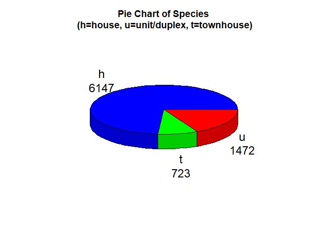
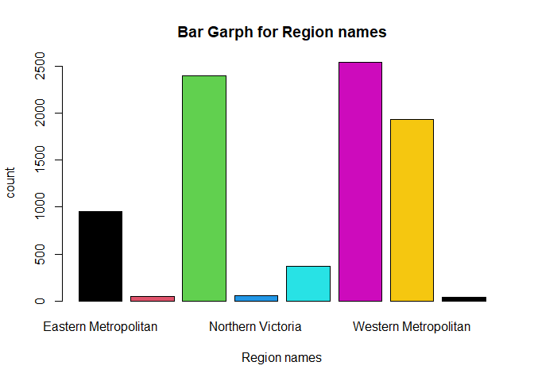
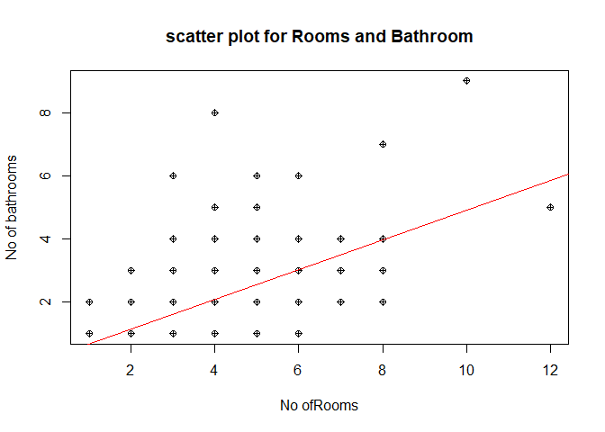
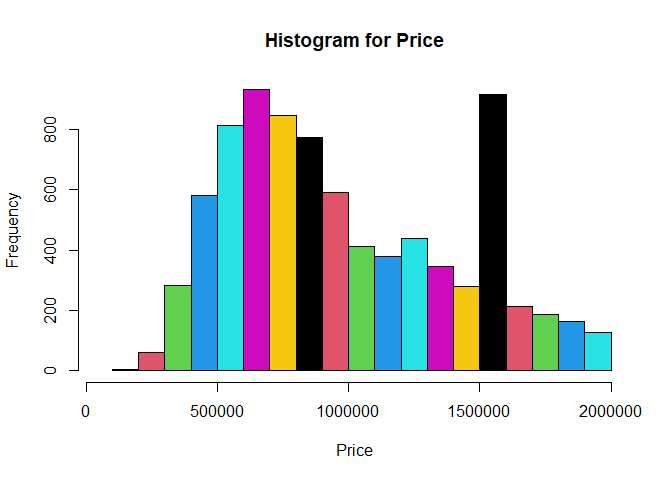
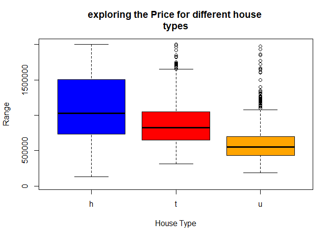
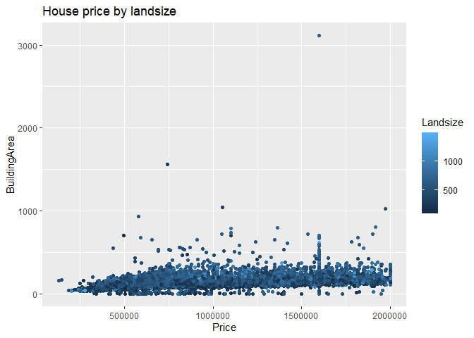
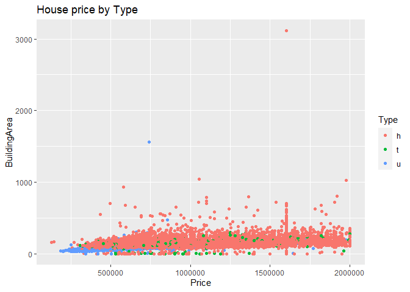

## Loading the Melbourne Data set

``` r
housing<- read.csv("C:/Program Files/R/melbourne_data.csv")
str(housing)
```

    ## 'data.frame':    34857 obs. of  13 variables:
    ##  $ X            : int  1 2 3 4 5 6 7 8 9 10 ...
    ##  $ Date         : chr  "3/09/2016" "3/12/2016" "4/02/2016" "4/02/2016" ...
    ##  $ Type         : chr  "h" "h" "h" "u" ...
    ##  $ Price        : int  NA 1480000 1035000 NA 1465000 850000 1600000 NA NA NA ...
    ##  $ Landsize     : int  126 202 156 0 134 94 120 400 201 202 ...
    ##  $ BuildingArea : num  NA NA 79 NA 150 NA 142 220 NA NA ...
    ##  $ Rooms        : int  2 2 2 3 3 3 4 4 2 2 ...
    ##  $ Bathroom     : int  1 1 1 2 2 2 1 2 1 2 ...
    ##  $ Car          : int  1 1 0 1 0 1 2 2 2 1 ...
    ##  $ YearBuilt    : int  NA NA 1900 NA 1900 NA 2014 2006 1900 1900 ...
    ##  $ Distance     : chr  "2.5" "2.5" "2.5" "2.5" ...
    ##  $ Regionname   : chr  "Northern Metropolitan" "Northern Metropolitan" "Northern Metropolitan" "Northern Metropolitan" ...
    ##  $ Propertycount: chr  "4019" "4019" "4019" "4019" ...

## Task

### Firstly the dataset should be cleaned and make it available for analysis by removing/replacings the NAs,outliers and incorrect values

#### Removing the NA values

``` r
housing<-na.omit(housing)
```

#### na.omit() fucntion is used to remove all the NA values from the dataset.

#### we can observe that the data set is large and there are multiple varaibles with many outliners.

#### For better visualisation we have replaced those outliners for some of the varaiables with the below code.

#### variable Landsize

``` r
housing[housing$Landsize < 100, "Landsize"]<- 250
housing[housing$Landsize >1500,"Landsize"]<- 500
```

#### Car Varaiable

``` r
housing= housing[!housing$Car<1,]
housing[housing$Car>6,"Car"]<-6
```

#### Price variable

``` r
housing$Price<-replace(housing$Price, housing$Price>2000000,1600000)
```

    #### The dataset after removing the outliners and incorrect/missing values
    
    ```r
    str(housing)

    ## 'data.frame':    8342 obs. of  13 variables:
    ##  $ X            : int  7 15 19 25 26 31 33 36 38 39 ...
    ##  $ Date         : chr  "4/06/2016" "8/10/2016" "8/10/2016" "12/11/2016" ...
    ##  $ Type         : chr  "h" "h" "h" "h" ...
    ##  $ Price        : num  1600000 1636000 1097000 1350000 750000 ...
    ##  $ Landsize     : num  120 256 220 214 250 238 113 138 150 780 ...
    ##  $ BuildingArea : num  142 107 75 190 94 97 110 105 73 135 ...
    ##  $ Rooms        : int  4 2 2 3 2 2 3 3 2 4 ...
    ##  $ Bathroom     : int  1 1 1 2 2 1 2 1 1 2 ...
    ##  $ Car          : num  2 2 2 2 1 2 1 1 1 2 ...
    ##  $ YearBuilt    : int  2014 1890 1900 2005 2009 1890 1880 1890 1985 1900 ...
    ##  $ Distance     : chr  "2.5" "2.5" "2.5" "2.5" ...
    ##  $ Regionname   : chr  "Northern Metropolitan" "Northern Metropolitan" "Northern Metropolitan" "Northern Metropolitan" ...
    ##  $ Propertycount: chr  "4019" "4019" "4019" "4019" ...
    ##  - attr(*, "na.action")= 'omit' Named int [1:25962] 1 2 4 6 8 9 10 11 13 14 ...
    ##   ..- attr(*, "names")= chr [1:25962] "1" "2" "4" "6" ...

### 2\) summary of the dataset gives the mean , meadian,1st Quartile,3rd Quartile,maximum,minimun values for all numerical variables

``` r
summary(housing)
```

    ##        X             Date               Type               Price        
    ##  Min.   :    7   Length:8342        Length:8342        Min.   : 131000  
    ##  1st Qu.: 6724   Class :character   Class :character   1st Qu.: 636000  
    ##  Median :13966   Mode  :character   Mode  :character   Median : 886500  
    ##  Mean   :15192                                         Mean   : 992389  
    ##  3rd Qu.:22911                                         3rd Qu.:1345750  
    ##  Max.   :34855                                         Max.   :2000000  
    ##     Landsize       BuildingArea        Rooms           Bathroom    
    ##  Min.   : 100.0   Min.   :   0.0   Min.   : 1.000   Min.   :1.000  
    ##  1st Qu.: 250.0   1st Qu.: 101.0   1st Qu.: 3.000   1st Qu.:1.000  
    ##  Median : 500.0   Median : 134.0   Median : 3.000   Median :2.000  
    ##  Mean   : 483.2   Mean   : 151.7   Mean   : 3.129   Mean   :1.672  
    ##  3rd Qu.: 649.8   3rd Qu.: 183.0   3rd Qu.: 4.000   3rd Qu.:2.000  
    ##  Max.   :1491.0   Max.   :3112.0   Max.   :12.000   Max.   :9.000  
    ##       Car          YearBuilt      Distance          Regionname       
    ##  Min.   :1.000   Min.   :1196   Length:8342        Length:8342       
    ##  1st Qu.:1.000   1st Qu.:1950   Class :character   Class :character  
    ##  Median :2.000   Median :1970   Mode  :character   Mode  :character  
    ##  Mean   :1.801   Mean   :1968                                        
    ##  3rd Qu.:2.000   3rd Qu.:2000                                        
    ##  Max.   :6.000   Max.   :2019                                        
    ##  Propertycount     
    ##  Length:8342       
    ##  Class :character  
    ##  Mode  :character  
    ##                    
    ##                    
    ## 

#### Here i have prepared 4 graphs with different variables

### Pie chart

``` r
mytable <- table(housing$Type)
lbls <- paste(names(mytable), "\n", mytable, sep="")
pie3D(mytable, labels = lbls,radius =1,
      main="Pie Chart of Species\n (h=house, u=unit/duplex, t=townhouse)",col= c("blue","green","red"))
```

<!-- -->

#### The above pie chart is for the House types and their respective count.

#### Here i have used plotrix package to form a 3D pie chart

## Bar Chart

``` r
barplot(table(housing$Regionname), main= "Bar Garph for Region names", xlab="Region names",ylab="count",col=(1:7),legend=rownames(housing$Regionname))
```

<!-- -->

#### The above Bar graph is for Region names

## Histogram

``` r
h<-hist(housing$Landsize,main="Landsize in meters",xlab = "Landsize",xlim = c(100,700),ylim = c(100,1000),col = "darkmagenta",freq = TRUE)
text(h$mids,h$counts,labels=h$counts,adj=c(0.5, -0.5))
```

<!-- -->

#### The above Histogram is for Landsize in meters

## scatterplot

``` r
a<-housing$Rooms
b<-housing$Bathroom
plot(a,b, main = "scatter plot for Rooms and Bathroom",xlab = "No ofRooms",ylab = "No of bathrooms",pch=10)
abline(lm(b~a), col="red")
```

<!-- -->

## 3\) Analysis on Price Variable

### 3a) Histogram for price variable

``` r
hist(housing$Price,xlim = c(50000,2000000),main= "Histogram for Price",xlab="Price",col=(1:7))
```

<!-- -->

``` r
summary(housing$Price)
```

    ##    Min. 1st Qu.  Median    Mean 3rd Qu.    Max. 
    ##  131000  636000  886500  992389 1345750 2000000

#### summary() gives the mean and median for the price varaiable along with other attributes

``` r
var(housing$Price)
```

    ## [1] 1.87924e+11

### The var() gives the varience for the price variable

## 3b) Grouping The Houses by price ranges such as Low, High, Medium

### Here i have installed dplyr package to use the group\_by()

### I have used the mutate() to create a new variable called state.

### I have obtained the summary for the groups.

``` r
y<-housing %>% group_by(Type) %>% mutate(state= cut(Price,breaks=3,labels=c("Low","Medium","high"),include.lowest = TRUE))
summary(y$state)
```

    ##    Low Medium   high 
    ##   3288   3093   1961

## 3c) Exploring the prices for different house types using boxplot

``` r
housetype<-c("h","t","u")
boxplot(housing$Price[housing$Type=="h"],housing$Price[housing$Type=="t"],housing$Price[housing$Type=="u"],main= "exploring the Price for different house 
types",ylim=c(30000,2000000),col = c("blue","red","orange"),xlab="House Type",ylab="Range",names = housetype)
```

<!-- -->

### 3d)The variables that are most correlated with price

### By using cor() with price and all the other variables we can observer that Rooms,Bathroom,BuildingArea are the three variables most correlated with price.

## 4)Listing the frequencies of various house type

``` r
table(housing$Type)
```

    ## 
    ##    h    t    u 
    ## 6147  723 1472

#### From the above we can see frequencies of various house types

### Scatter plots

### scatter plot of houseprice by landsize

### here i have installed gglpot2 package to use the ggplot function

``` r
ggplot(housing,aes(Price,BuildingArea, col = Landsize),xlim(500000,2000000),ylim(0,500))+ geom_point()+ggtitle("House price by landsize")
```

<!-- -->

### Scatter plot of Houseprice by Type

``` r
ggplot(housing,aes(Price,BuildingArea, col = Type))+ geom_point()+ggtitle("House price by Type")
```

<!-- -->
