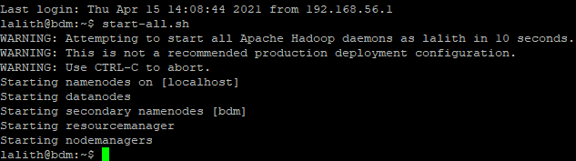

#  Off-line Processing of M50 Data using Apache Spark's Dataframe

I have prepared a batch layer(Off-line processing pipeline) of the lambda architecture that enables to perform some analytics on M50 Highway data using Apache Spark's Dataframe.


## Description of Dataset

Dataset is about M50 Highway Traffic data. I have acquired it from Transport Infrastructure Ireland (TII) (https://www.tii.ie) that operates and maintains a network of trafc counters on the motorway, national primary and secondary road networks in Ireland.

These traffic counters capture data on diferent parameters. There are currently around 400 of these counters active across the network. For an interactive view of the data they capture, go to the TII Trafc Counter Data Website: (https://www.nratrafficdata.ie)

The traffic counter data set is a valuable source of information on vehicle movements across the national road network and is made available
publicly in its raw form The frst row of each fle contains headers which describe each feld. However, the meaning of some of these may not be apparent to consumers.

The following explains some of the less obvious column headers:
cosit: The unique identifier for the traffic counter device. In conjunction with the site’s dataset, this can be used to determine the location and route of the counter, used to record the vehicle movement.
* lane: The Id of the lane in which the movement was recorded, which is specific to each counter.
* straddlelane: If a value is present, this indicates that the vehicle may have been changing lanes as it passed over the counter.
* class/classname: This indicates the category of vehicle that was recorded e.g. car, bus, etc.
* length: The approximate length of the vehicle recorded.
* headway: The approximate distance between the front of the recorded vehicle and the vehicle behind.
* gap: The approximate distance between the rear of the vehicle and the front of the vehicle behind.
* weight: This is available on (Weigh-in-Motion) WIM sites only and indicates the approximate weight of the vehicle.
* temperature: If available, this indicates the approximate surface temperature of the road at the location of the device.
* numberofaxles: This is available on WIM sites only and indicates the number of axles detected for the vehicle.
* axleweights: This is available on WIM sites only and expresses as an array of real numbers, the weight over each axel in order.
* axlespacing: This is available on WIM sites only and expresses as an array of real numbers, the distance between each of the axles.


The data is updated and published daily, one day in arrears. The traffic counters on average generate over 4 million records for each day. The aggregated data from all trafc counters is a very large multi-terabyte dataset. Without doubt this is a big data management problem.

#### Set up
I have setup hadoop on ubuntu VM in Pseudo Distributed Operation (for storing the data in HDFS) and Apache Spark.
I have Installed Jupyter Notebook linked with PySpark. 



I have downloaded the dataset and moved it into HDFS file system, and loaded it into a Dataframe using PySpark.

### Execution

Importing all sparkcontext, sparkconf,sparksession from pyspark 


```python
from pyspark import SparkContext, SparkConf 
from pyspark.sql import SparkSession
```


```python
sc = SparkContext.getOrCreate();
```


```python
spark=SparkSession.builder.getOrCreate()
```


```python
ss= spark
```

### 1) Loading the csv file from the Hdfs file system

Loading the csv file from hdfs requires the hadoop services to be started.


```python
vehicle_records_DF = spark.read.csv("hdfs://localhost:9000/user/lalith/data/per-vehicle-records-2021-01-31.csv", inferSchema = True, header = True)

```

A DataFrame vehicle_records_DF has been created with default schema.


```python
vehicle_records_DF.show()
```

    +-----+----+-----+---+----+------+------+-----------+-----------+----+--------+------------+----------------+-----+---------+------+-------+----+-----+------+-----------+--------+------------+-------------+-----------+------------+
    |cosit|year|month|day|hour|minute|second|millisecond|minuteofday|lane|lanename|straddlelane|straddlelanename|class|classname|length|headway| gap|speed|weight|temperature|duration|validitycode|numberofaxles|axleweights|axlespacings|
    +-----+----+-----+---+----+------+------+-----------+-----------+----+--------+------------+----------------+-----+---------+------+-------+----+-----+------+-----------+--------+------------+-------------+-----------+------------+
    |  998|2021|    1| 31|   2|    45|     0|          0|        165|   2|    Ch 2|           0|            null|    2|      CAR|   5.2|   1.07|1.13| 71.0|   0.0|        0.0|       0|           0|            0|       null|        null|
    |  998|2021|    1| 31|   2|    45|     1|          0|        165|   2|    Ch 2|           0|            null|    5|  HGV_RIG|  11.1|    1.1|1.34| 69.0|   0.0|        0.0|       0|           0|            0|       null|        null|
    |  998|2021|    1| 31|   2|    45|     1|          0|        165|   1|    Ch 1|           0|            null|    5|  HGV_RIG|  11.1|   1.17|1.11| 69.0|   0.0|        0.0|       0|           0|            0|       null|        null|
    |  998|2021|    1| 31|   2|    45|     2|          0|        165|   1|    Ch 1|           0|            null|    2|      CAR|   5.3|    1.0|0.72| 70.0|   0.0|        0.0|       0|           0|            0|       null|        null|
    |  998|2021|    1| 31|   2|    45|     3|          0|        165|   2|    Ch 2|           0|            null|    3|      LGV|   5.3|   1.01|0.72| 71.0|   0.0|        0.0|       0|           0|            0|       null|        null|
    |  998|2021|    1| 31|   2|    45|     4|          0|        165|   1|    Ch 1|           0|            null|    2|      CAR|   5.2|   1.62|1.63| 70.0|   0.0|        0.0|       0|           0|            0|       null|        null|
    |  998|2021|    1| 31|   2|    45|     5|          0|        165|   2|    Ch 2|           0|            null|    3|      LGV|   5.2|   1.64|1.63| 69.0|   0.0|        0.0|       0|           0|            0|       null|        null|
    |  998|2021|    1| 31|   2|    45|     6|          0|        165|   1|    Ch 1|           0|            null|    5|  HGV_RIG|  11.4|   1.13|1.53| 70.0|   0.0|        0.0|       0|           0|            0|       null|        null|
    |  998|2021|    1| 31|   2|    45|     7|          0|        165|   2|    Ch 2|           0|            null|    5|  HGV_RIG|  11.4|   1.39|1.83| 71.0|   0.0|        0.0|       0|           0|            0|       null|        null|
    |  998|2021|    1| 31|   2|    45|     8|          0|        165|   1|    Ch 1|           0|            null|    5|  HGV_RIG|  11.1|   1.36|1.31| 69.0|   0.0|        0.0|       0|           0|            0|       null|        null|
    |  998|2021|    1| 31|   2|    45|     8|          0|        165|   2|    Ch 2|           0|            null|    2|      CAR|   5.2|   1.57|1.22| 69.0|   0.0|        0.0|       0|           0|            0|       null|        null|
    |  998|2021|    1| 31|   2|    45|     9|          0|        165|   1|    Ch 1|           0|            null|    2|      CAR|   5.2|   1.16|0.92| 70.0|   0.0|        0.0|       0|           0|            0|       null|        null|
    |  998|2021|    1| 31|   2|    45|    10|          0|        165|   2|    Ch 2|           0|            null|    5|  HGV_RIG|  11.5|   1.34|1.63| 71.0|   0.0|        0.0|       0|           0|            0|       null|        null|
    |  998|2021|    1| 31|   2|    45|    11|          0|        165|   1|    Ch 1|           0|            null|    5|  HGV_RIG|  11.1|   1.72|1.93| 69.0|   0.0|        0.0|       0|           0|            0|       null|        null|
    |  998|2021|    1| 31|   2|    45|    12|          0|        165|   2|    Ch 2|           0|            null|    2|      CAR|   5.2|   1.34|1.12| 71.0|   0.0|        0.0|       0|           0|            0|       null|        null|
    |  998|2021|    1| 31|   2|    45|    13|          0|        165|   1|    Ch 1|           0|            null|    2|      CAR|   5.1|   1.17|0.92| 69.0|   0.0|        0.0|       0|           0|            0|       null|        null|
    |  998|2021|    1| 31|   2|    45|    14|          0|        165|   1|    Ch 1|           0|            null|    2|      CAR|   5.1|   1.28|1.23| 69.0|   0.0|        0.0|       0|           0|            0|       null|        null|
    |  998|2021|    1| 31|   2|    45|    14|          0|        165|   2|    Ch 2|           0|            null|    5|  HGV_RIG|  11.3|   1.07|1.34| 69.0|   0.0|        0.0|       0|           0|            0|       null|        null|
    |  998|2021|    1| 31|   2|    45|    15|          0|        165|   1|    Ch 1|           0|            null|    2|      CAR|   5.1|   1.02|1.03| 69.0|   0.0|        0.0|       0|           0|            0|       null|        null|
    |  998|2021|    1| 31|   2|    45|    16|          0|        165|   2|    Ch 2|           0|            null|    5|  HGV_RIG|  11.5|   1.27|1.31| 71.0|   0.0|        0.0|       0|           0|            0|       null|        null|
    +-----+----+-----+---+----+------+------+-----------+-----------+----+--------+------------+----------------+-----+---------+------+-------+----+-----+------+-----------+--------+------------+-------------+-----------+------------+
    only showing top 20 rows
    
    

Count of number of records in the loaded csv file.


```python
vehicle_records_DF.count()
```


    1106652


```python
vehicle_records_DF.schema
```


    StructType(List(StructField(cosit,IntegerType,true),StructField(year,IntegerType,true),StructField(month,IntegerType,true),StructField(day,IntegerType,true),StructField(hour,IntegerType,true),StructField(minute,IntegerType,true),StructField(second,IntegerType,true),StructField(millisecond,IntegerType,true),StructField(minuteofday,IntegerType,true),StructField(lane,IntegerType,true),StructField(lanename,StringType,true),StructField(straddlelane,IntegerType,true),StructField(straddlelanename,StringType,true),StructField(class,IntegerType,true),StructField(classname,StringType,true),StructField(length,DoubleType,true),StructField(headway,DoubleType,true),StructField(gap,DoubleType,true),StructField(speed,DoubleType,true),StructField(weight,DoubleType,true),StructField(temperature,DoubleType,true),StructField(duration,IntegerType,true),StructField(validitycode,IntegerType,true),StructField(numberofaxles,IntegerType,true),StructField(axleweights,StringType,true),StructField(axlespacings,StringType,true)))


```python
type(vehicle_records_DF)
```


    pyspark.sql.dataframe.DataFrame


```python

```

Before performing the analysis on the Dataset, Intially i need to filter the dataset by identifying the M50 cosits from  junction 3 to junction 17 as per requirement.

Firstly, i need to identify the cosits on m50 highway by refering to the map of irish road traffic data and the dataset.
There are 15 counters present on m50 highway out of which 13 counters present in between junction 3 to 17. 

I need data for only those counters. so let's create a dataframe that contains only the required data by filtering the orginial dataset. 


```python
cositlist = [1500,1501,1502,1508,1503,1509,1504,1505,1506,1507,15010,15011,15012]

m50cositdf = vehicle_records_DF.where(vehicle_records_DF.cosit.isin(cositlist))
```


```python
type(m50cositdf)
```


    pyspark.sql.dataframe.DataFrame


```python
The below dataframe consists of records for only m50 counters between junction 3 to junction 17
```


```python
m50cositdf.show()
```

    +-----+----+-----+---+----+------+------+-----------+-----------+----+------------+------------+----------------+-----+---------+------+-------+------+-----+------+-----------+--------+------------+-------------+-----------+------------+
    |cosit|year|month|day|hour|minute|second|millisecond|minuteofday|lane|    lanename|straddlelane|straddlelanename|class|classname|length|headway|   gap|speed|weight|temperature|duration|validitycode|numberofaxles|axleweights|axlespacings|
    +-----+----+-----+---+----+------+------+-----------+-----------+----+------------+------------+----------------+-----+---------+------+-------+------+-----+------+-----------+--------+------------+-------------+-----------+------------+
    | 1500|2021|    1| 31|   2|    45|     7|          0|        165|   2|Northbound 2|           0|            null|    3|      LGV|   5.1|  233.7|233.53|101.0|   0.0|        0.0|       0|           0|            0|       null|        null|
    | 1500|2021|    1| 31|   2|    45|    16|          0|        165|   2|Northbound 2|           0|            null|    5|  HGV_RIG|   9.6|    8.3|  8.12| 90.0|   0.0|        0.0|       0|           0|            0|       null|        null|
    | 1500|2021|    1| 31|   2|    45|    33|          0|        165|   2|Northbound 2|           0|            null|    2|      CAR|   3.9|   17.0| 16.62| 86.0|   0.0|        0.0|       0|           0|            0|       null|        null|
    | 1500|2021|    1| 31|   2|    45|    41|          0|        165|   4|Northbound 4|           0|            null|    2|      CAR|   3.9|    0.0|   0.0| 94.0|   0.0|        0.0|       0|           0|            0|       null|        null|
    | 1500|2021|    1| 31|   2|    45|    46|          0|        165|   1|Northbound 1|           0|            null|    3|      LGV|   5.9|  167.9|167.71| 89.0|   0.0|        0.0|       0|           0|            0|       null|        null|
    | 1500|2021|    1| 31|   2|    46|    13|          0|        166|   5|Northbound 5|           0|            null|    2|      CAR|   4.5|  135.9|135.69| 91.0|   0.0|        0.0|       0|           0|            0|       null|        null|
    | 1500|2021|    1| 31|   2|    46|    14|          0|        166|   1|Northbound 1|           0|            null|    2|      CAR|   4.1|   27.5| 27.26| 97.0|   0.0|        0.0|       0|           0|            0|       null|        null|
    | 1500|2021|    1| 31|   2|    46|    14|          0|        166|   8|Southbound 3|           0|            null|    2|      CAR|   4.3|  227.7|227.54| 85.0|   0.0|        0.0|       0|           0|            0|       null|        null|
    | 1500|2021|    1| 31|   2|    46|    21|          0|        166|   1|Northbound 1|           0|            null|    2|      CAR|   4.1|    7.5|  7.35| 89.0|   0.0|        0.0|       0|           0|            0|       null|        null|
    | 1500|2021|    1| 31|   2|    46|    44|          0|        166|   8|Southbound 3|           0|            null|    2|      CAR|   4.3|   29.9| 29.72| 83.0|   0.0|        0.0|       0|           0|            0|       null|        null|
    | 1500|2021|    1| 31|   2|    47|     6|          0|        167|   8|Southbound 3|           0|            null|    2|      CAR|   3.5|   22.2| 22.01|105.0|   0.0|        0.0|       0|           0|            0|       null|        null|
    | 1500|2021|    1| 31|   2|    47|    22|          0|        167|   2|Northbound 2|           0|            null|    6|  HGV_ART|  18.9|  109.0|108.84| 90.0|   0.0|        0.0|       0|           0|            0|       null|        null|
    | 1500|2021|    1| 31|   2|    47|    46|          0|        167|   8|Southbound 3|           0|            null|    2|      CAR|   4.0|   39.9| 39.78| 97.0|   0.0|        0.0|       0|           0|            0|       null|        null|
    | 1500|2021|    1| 31|   2|    49|     7|          0|        169|   2|Northbound 2|           0|            null|    3|      LGV|   6.4|  105.7|104.94|119.0|   0.0|        0.0|       0|           0|            0|       null|        null|
    | 1500|2021|    1| 31|   2|    49|    36|          0|        169|   2|Northbound 2|           0|            null|    5|  HGV_RIG|  11.9|   28.4| 28.21| 94.0|   0.0|        0.0|       0|           0|            0|       null|        null|
    | 1500|2021|    1| 31|   2|    50|     7|          0|        170|   1|Northbound 1|           0|            null|    2|      CAR|   4.4|  226.1|225.93| 85.0|   0.0|        0.0|       0|           0|            0|       null|        null|
    | 1500|2021|    1| 31|   2|    50|    17|          0|        170|   2|Northbound 2|           0|            null|    2|      CAR|   4.2|   41.7| 41.24| 74.0|   0.0|        0.0|       0|           0|            0|       null|        null|
    | 1500|2021|    1| 31|   2|    50|    17|          0|        170|   6|Southbound 1|           0|            null|    2|      CAR|   4.6|  459.7|459.51| 83.0|   0.0|        0.0|       0|           0|            0|       null|        null|
    | 1500|2021|    1| 31|   2|    50|    18|          0|        170|   6|Southbound 1|           0|            null|    3|      LGV|   5.0|   2.16|   1.7| 81.0|   0.0|        0.0|       0|           0|            0|       null|        null|
    | 1500|2021|    1| 31|   2|    50|    21|          0|        170|   6|Southbound 1|           0|            null|    6|  HGV_ART|  16.1|   2.81|  2.08| 71.0|   0.0|        0.0|       0|           0|            0|       null|        null|
    +-----+----+-----+---+----+------+------+-----------+-----------+----+------------+------------+----------------+-----+---------+------+-------+------+-----+------+-----------+--------+------------+-------------+-----------+------------+
    only showing top 20 rows
    
    


```python
m50cositdf.select("cosit").count()
```


    181582


#### Calculating the usage of Irish road network in terms of percentage  by vehicle category


```python
from pyspark.sql import Row
from pyspark.sql import SparkSession
import pyspark.sql.functions as F
from pyspark.sql.types import *
from pyspark.sql.functions import col
```


```python
m50cositdf.groupby('classname').agg(
    (F.count('classname')).alias('count'),
    (F.round(F.count('classname') / m50cositdf.count() * 100,3)).alias('percentage')
).show()
```

    +---------+------+----------+
    |classname| count|percentage|
    +---------+------+----------+
    |      CAR|154927|    85.321|
    |  HGV_ART|  5460|     3.007|
    |      BUS|  1107|      0.61|
    |  HGV_RIG|  1262|     0.695|
    |     null|     0|       0.0|
    |  CARAVAN|   610|     0.336|
    |      LGV| 17860|     9.836|
    |    MBIKE|   355|     0.196|
    +---------+------+----------+
    
    

From the above query we can find the usage of irish road network by each vehicle class. From the result we can observe that classname CAR has the highest uasge with percentage of 85.321

#### Calculating the highest and lowest hourly fows on M50 - show the hours and total number of vehicle counts.


```python
m50cositdf.select("hour").groupBy("hour").count().sort("count", ascending=False).show(24)
```

    +----+-----+
    |hour|count|
    +----+-----+
    |  15|17211|
    |  16|16575|
    |  14|16373|
    |  13|15784|
    |  17|14742|
    |  12|11768|
    |  18|11503|
    |  11|10943|
    |  19| 9769|
    |  20| 9437|
    |  10| 8310|
    |  21| 6426|
    |   9| 6055|
    |   7| 5720|
    |   8| 4922|
    |   6| 3483|
    |  22| 3389|
    |  23| 2664|
    |   0| 1844|
    |   5| 1288|
    |   1| 1187|
    |   2|  891|
    |   4|  788|
    |   3|  510|
    +----+-----+
    
    

The above query gives the count of vehicles per hour, we can observe that hours 13 -17 has highest uage, while hours 1 - 5 has least uasge

#### Calculating the evening and morning rush hours on M50 - show the hours and the total counts


```python
morning_hours = [9,10,11]
evening_hours = [20,21,22]
```


```python
m50cositdf.where(m50cositdf.hour.isin(morning_hours)).select(m50cositdf.hour.alias("Morning rush hours between 9-12")).groupBy("Morning rush hours between 9-12").count().sort("Morning rush hours between 9-12", ascending= False).show()
```

    +-------------------------------+-----+
    |Morning rush hours between 9-12|count|
    +-------------------------------+-----+
    |                             11|10943|
    |                             10| 8310|
    |                              9| 6055|
    +-------------------------------+-----+
    
    

The above query identifies the morning rush hours and the count of vehicles per that hour. We can observe that morning rush hours are between 9 -12


```python
m50cositdf.where(m50cositdf.hour.isin(evening_hours)).select(m50cositdf.hour.alias("Evening rush hours between 20-22")).groupBy("Evening rush hours between 20-22").count().sort("Evening rush hours between 20-22", ascending= False).show()
```

    +--------------------------------+-----+
    |Evening rush hours between 20-22|count|
    +--------------------------------+-----+
    |                              22| 3389|
    |                              21| 6426|
    |                              20| 9437|
    +--------------------------------+-----+
    
    

The above query identifies the Evening rush hours and the count of vehicles per that hour. We can observe that evening rush hours are between 20 -22

#### Calculating the average speed between each junctions on M50


```python
m50cositdf.filter(col("cosit").isin(cositlist)).select(col("cosit"),col("speed")).groupBy("cosit").agg(F.avg("speed").alias("average_speed")).show()

```

    +-----+------------------+
    |cosit|     average_speed|
    +-----+------------------+
    | 1507|102.74182687085913|
    | 1500| 93.74959897337183|
    | 1506|102.79217719132893|
    | 1505| 99.69152287044645|
    | 1504|101.99216139028985|
    |15010| 105.0165992764418|
    |15012|105.10443959243086|
    | 1509| 98.35261039422281|
    | 1502|102.36304050088046|
    |15011|101.79879709487064|
    | 1501|101.33084897730457|
    | 1503|102.18442775736273|
    | 1508| 98.64505637467477|
    +-----+------------------+
    
    

The above the query gives the average vehicle speed recorded at each counter.


```python
junctionlist =[("Junction 3-4", 1500),("Junction 4-5", 1501),("Junction 5-6", 1502),("Junction 6-7",1508),("Junction 7-9",1503),("Junction 9-10",1509),("Junction 10-11",1504),("Junction 11-12",1505),("Junction 12-13",1506),("Junction 13-14",1507),("Junction 14-15",15010),("Junction 15-16",15011),("Junction 16-17",15012)]
jun= sc.parallelize(junctionlist).collect()
juncdataf=spark.createDataFrame(jun, ["Junctions","cosits"])
m50=m50cositdf.filter(col("cosit").isin(cositlist)).select(col("cosit"),col("speed")).groupBy("cosit").agg(F.round(F.avg("speed"),0).alias("Average Speed"))
Finaldf=m50.alias('a').join(juncdataf.alias('b'),col('a.cosit') == col('b.cosits'))

Finaldata = Finaldf.drop("cosits")
Finaldata.show()
```

    +-----+-------------+--------------+
    |cosit|Average Speed|     Junctions|
    +-----+-------------+--------------+
    | 1505|        100.0|Junction 11-12|
    | 1508|         99.0|  Junction 6-7|
    | 1501|        101.0|  Junction 4-5|
    | 1504|        102.0|Junction 10-11|
    |15010|        105.0|Junction 14-15|
    | 1506|        103.0|Junction 12-13|
    | 1507|        103.0|Junction 13-14|
    | 1509|         98.0| Junction 9-10|
    | 1500|         94.0|  Junction 3-4|
    | 1502|        102.0|  Junction 5-6|
    | 1503|        102.0|  Junction 7-9|
    |15011|        102.0|Junction 15-16|
    |15012|        105.0|Junction 16-17|
    +-----+-------------+--------------+
    
    

This is a refined output for this question, I have added the  junction numbers at which the respective counter is located and the percentage is rounded to 1 decimal.

#### Calculating the top 10 locations with highest number of counts of HGVs(class)and Mapping  the COSITs with their names given on the map


```python
locationlist =[("TMU M50 001.7 N", 1500),("TMU M50 005.0 N", 1501),("TMU M50 010.0 N", 1502),("TMU M50 015.0 S",1508),("TMU M50 020.0 N",1503),("TMU M50 015.0 N",1509),("TMU M50 025.0 S",1504),("TMU M50 025.0 N",1505),("TMU M50 030.0 S",1506),("TMU M50 035.0 S",1507),("TMU M50 040.0 S",15010),("TMU M50 035.0 N",15011),("TMU M50 040.0 N",15012)]
nm= sc.parallelize(locationlist).collect()
dataf=spark.createDataFrame(nm, ["location","cosits"])
dataf.show()
```

    +---------------+------+
    |       location|cosits|
    +---------------+------+
    |TMU M50 001.7 N|  1500|
    |TMU M50 005.0 N|  1501|
    |TMU M50 010.0 N|  1502|
    |TMU M50 015.0 S|  1508|
    |TMU M50 020.0 N|  1503|
    |TMU M50 015.0 N|  1509|
    |TMU M50 025.0 S|  1504|
    |TMU M50 025.0 N|  1505|
    |TMU M50 030.0 S|  1506|
    |TMU M50 035.0 S|  1507|
    |TMU M50 040.0 S| 15010|
    |TMU M50 035.0 N| 15011|
    |TMU M50 040.0 N| 15012|
    +---------------+------+
    
    

I have a created a list of location names and its cosits and converted it to a dataframe 


```python
df=m50cositdf.select(m50cositdf.cosit,m50cositdf.classname)

```


```python
mergeddf=df.alias('a').join(dataf.alias('b'),col('a.cosit') == col('b.cosits'))

mergeddf1 = mergeddf.drop("cosits")

qw=["HGV_RIG","HGV_ART"]
mergeddf1.select(mergeddf1.cosit,mergeddf1.classname,mergeddf1.location).filter(mergeddf1.classname.isin(qw)).groupby("cosit","location").count().sort("count", ascending =False).show(10)
```

    +-----+---------------+-----+
    |cosit|       location|count|
    +-----+---------------+-----+
    | 1508|TMU M50 015.0 S| 1224|
    | 1502|TMU M50 010.0 N| 1186|
    | 1503|TMU M50 020.0 N|  962|
    | 1501|TMU M50 005.0 N|  923|
    | 1500|TMU M50 001.7 N|  663|
    | 1509|TMU M50 015.0 N|  375|
    | 1504|TMU M50 025.0 S|  291|
    | 1505|TMU M50 025.0 N|  218|
    | 1506|TMU M50 030.0 S|  217|
    |15010|TMU M50 040.0 S|  189|
    +-----+---------------+-----+
    only showing top 10 rows
    
    

I have joined the two dataframes to the get the location name next to the cosit, The above query gives the top 10 locations and its cosits with highest counts of vehicles.
