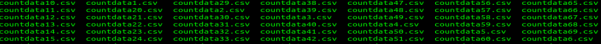
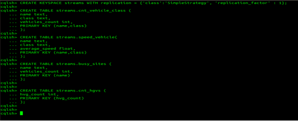

### Real Time Processing using Spark Streaming API

I have prepared a stream layer(On-line processing pipeline) of the lambda architecture that enables to perform some analytics on M50 Highway data using Spark Streaming API. 

To emulate a live-stream of the traffic counter dataset, I wrote a separate Python script that reads 10 records for every 5 seconds for every traffic counter and stores them in a streaming directory.

I have prepared cassandra structures and the spark code that saves the computed batch views into these structures.


## Description of Dataset

Dataset is about M50 Highway Traffic data. I have acquired it from Transport Infrastructure Ireland (TII) (https://www.tii.ie) that operates and maintains a network of trafc counters on the motorway, national primary and secondary road networks in Ireland.

These traffic counters capture data on diferent parameters. There are currently around 400 of these counters active across the network. For an interactive view of the data they capture, go to the TII Trafc Counter Data Website: (https://www.nratrafficdata.ie)

The traffic counter data set is a valuable source of information on vehicle movements across the national road network and is made available
publicly in its raw form The frst row of each fle contains headers which describe each feld. However, the meaning of some of these may not be apparent to consumers.

The following explains some of the less obvious column headers:
* cosit: The unique identifier for the traffic counter device. In conjunction with the site’s dataset, this can be used to determine the location and route of the counter, used to record the vehicle movement.
* lane: The Id of the lane in which the movement was recorded, which is specific to each counter.
* straddlelane: If a value is present, this indicates that the vehicle may have been changing lanes as it passed over the counter.
* class/classname: This indicates the category of vehicle that was recorded e.g. car, bus, etc.
* length: The approximate length of the vehicle recorded.
* headway: The approximate distance between the front of the recorded vehicle and the vehicle behind.
* gap: The approximate distance between the rear of the vehicle and the front of the vehicle behind.
* weight: This is available on (Weigh-in-Motion) WIM sites only and indicates the approximate weight of the vehicle.
* temperature: If available, this indicates the approximate surface temperature of the road at the location of the device.
* numberofaxles: This is available on WIM sites only and indicates the number of axles detected for the vehicle.
* axleweights: This is available on WIM sites only and expresses as an array of real numbers, the weight over each axel in order.
* axlespacing: This is available on WIM sites only and expresses as an array of real numbers, the distance between each of the axles.


The data is updated and published daily, one day in arrears. The traffic counters on average generate over 4 million records for each day. The aggregated data from all trafc counters is a very large multi-terabyte dataset. Without doubt this is a big data management problem.

#### Set up
I have setup hadoop on ubuntu VM in Pseudo Distributed Operation (for storing the data in HDFS) and Apache Spark.
I have Installed Jupyter Notebook linked with PySpark. 


### Execution

```python
# Configuratins related to Cassandra connector & Cluster
import os
os.environ['PYSPARK_SUBMIT_ARGS'] = '--packages com.datastax.spark:spark-cassandra-connector_2.12:3.0.0 --conf spark.cassandra.connection.host=127.0.0.1 pyspark-shell'
```


```python
# Import packages
from pyspark import SparkContext
from pyspark.streaming import StreamingContext
from pyspark.sql import Row, SparkSession
```


```python
# Define spark session instance
def getSparkSessionInstance(sparkConf):
    if ('sparkSessionSingletonInstance' not in globals()):
        globals()['sparkSessionSingletonInstance'] = SparkSession\
            .builder\
            .config(conf=sparkConf)\
            .getOrCreate()
    return globals()['sparkSessionSingletonInstance']
```


```python
# Create streaming object to poll directory at 5 seconds interval
sc = SparkContext(appName="TrafficViews")
ssc = StreamingContext(sc, 5)
data = ssc.textFileStream("stream2/")
```

From the vehicle records file containing traffic data, I have generated live streaming data for every 5 seconds using python script.



###  Real-time Views


```python
# Process streams and write to Cassandra
def streamProcessor(time, rdd):
    
    try:
        # Get the singleton instance of SparkSession
        spark = getSparkSessionInstance(rdd.context.getConf())

        # Convert Dstream to dataframe
        rowHeader = rdd.take(1)[0] # Filter header from the stream
        cleanedRdd = rdd.filter(lambda line: line != rowHeader)
        rowRdd = cleanedRdd.map(lambda w: w.split(","))

        columns = ["cosit","name","class","classname","speed"]
        streamedData = rowRdd.toDF(columns)
        # Creates a temporary view using the DataFrame.
        streamedData.createOrReplaceTempView("traffic_streams")

        # 1) Vehicles count by class on each site of M50
        vehiclesCount = spark.sql("""SELECT name, class, COUNT(*) vehicles_count FROM traffic_streams
                        WHERE name LIKE '%M50%' GROUP BY name, class""")
        vehiclesCount.show()
        # Write to cassandra
        vehiclesCount.write.format("org.apache.spark.sql.cassandra").mode("append").\
        options(table="cnt_vehicle_class", keyspace="streams").save()
        
        # 2) Average speed (on each site on M50) by vehicle class.  
        vehicles_speed = spark.sql("""SELECT name, class, AVG(speed) average_speed FROM traffic_streams
                        WHERE name LIKE '%M50%' GROUP BY name, class""")
        vehicles_speed.show()
        # Write to cassandra
        vehicles_speed.write.format("org.apache.spark.sql.cassandra").mode("append").\
        options(table="speed_vehicle", keyspace="streams").save()
        
        # 3) Top3 busiest counter sites on M50
        busiestSites = spark.sql("""SELECT name, COUNT(*) vehicles_count FROM traffic_streams
                        WHERE name LIKE '%M50%' GROUP BY name ORDER BY vehicles_count DESC LIMIT 3 """)
        busiestSites.show()
        # Write to cassandra
        busiestSites.write.format("org.apache.spark.sql.cassandra").mode("append").\
        options(table="busy_sites", keyspace="streams").save()
        
        # 4) Total number of counts for HVGs on M50.
        hvgCount = spark.sql("""SELECT COUNT(*) hvg_count FROM traffic_streams
                        WHERE name LIKE '%M50%' and classname LIKE '%HGV%'""")
        hvgCount.show()
        # Write to cassandra
        hvgCount.write.format("org.apache.spark.sql.cassandra").mode("append").\
        options(table="cnt_hgvs", keyspace="streams").save()


    except:
        pass
```


```python
data.foreachRDD(streamProcessor)
ssc.start()
```

    +--------------------+-----+--------------+
    |                name|class|vehicles_count|
    +--------------------+-----+--------------+
    |     TMU M50 020.0 N|    2|             3|
    |     TMU M50 040.0 N|    3|             2|
    |     TMU M50 000.0 N|    3|             1|
    |     TMU M50 000.0 N|    6|             1|
    |     TMU M50 025.0 N|    2|             5|
    |    TMU M50 030.0 S |    3|             3|
    |     TMU M50 040.0 N|    6|             3|
    |"TMU M50 015.0 N ...|    5|             1|
    |     TMU M50 025.0 N|    3|             3|
    |     TMU M50 025.0 S|    4|             1|
    |     TMU M50 035.0 S|    6|             2|
    |"TMU M50 015.0 N ...|    2|             6|
    |     TMU M50 040.0 S|    4|             1|
    |     TMU M50 000.0 N|    4|             2|
    |     TMU M50 035.0 N|    4|             2|
    |    TMU M50 010.0 N |    2|             5|
    |     TMU M50 020.0 N|    3|             3|
    |     TMU M50 005.0 N|    2|             3|
    |"TMU M50 015.0 N ...|    3|             2|
    |     TMU M50 035.0 S|    3|             1|
    +--------------------+-----+--------------+
    only showing top 20 rows
    
    +--------------------+-----+------------------+
    |                name|class|     average_speed|
    +--------------------+-----+------------------+
    |     TMU M50 020.0 N|    2|              98.0|
    |     TMU M50 040.0 N|    3|             134.5|
    |     TMU M50 000.0 N|    3|              81.0|
    |     TMU M50 000.0 N|    6|              64.0|
    |     TMU M50 025.0 N|    2|              98.2|
    |    TMU M50 030.0 S |    3|103.66666666666667|
    |     TMU M50 040.0 N|    6| 87.33333333333333|
    |"TMU M50 015.0 N ...|    5|              93.0|
    |     TMU M50 025.0 N|    3|              98.0|
    |     TMU M50 025.0 S|    4|              64.0|
    |     TMU M50 035.0 S|    6|              76.0|
    |"TMU M50 015.0 N ...|    2| 87.33333333333333|
    |     TMU M50 040.0 S|    4|              65.0|
    |     TMU M50 000.0 N|    4|              72.5|
    |     TMU M50 035.0 N|    4|              63.0|
    |    TMU M50 010.0 N |    2|             111.4|
    |     TMU M50 020.0 N|    3|115.33333333333333|
    |     TMU M50 005.0 N|    2|             102.0|
    |"TMU M50 015.0 N ...|    3|              99.0|
    |     TMU M50 035.0 S|    3|             109.0|
    +--------------------+-----+------------------+
    only showing top 20 rows
    
    +---------------+--------------+
    |           name|vehicles_count|
    +---------------+--------------+
    |TMU M50 001.7 N|            10|
    |TMU M50 005.0 N|            10|
    |TMU M50 040.0 N|            10|
    +---------------+--------------+
    
    +---------+
    |hvg_count|
    +---------+
    |       28|
    +---------+
    
    +--------------------+-----+--------------+
    |                name|class|vehicles_count|
    +--------------------+-----+--------------+
    |    TMU M50 010.0 N |    6|             3|
    |     TMU M50 020.0 N|    2|             4|
    |     TMU M50 035.0 S|    5|             1|
    |     TMU M50 040.0 N|    3|             2|
    |     TMU M50 000.0 N|    3|             1|
    |    TMU M50 030.0 S |    7|             1|
    |     TMU M50 000.0 N|    6|             2|
    |     TMU M50 025.0 N|    2|             7|
    |     TMU M50 040.0 N|    6|             1|
    |"TMU M50 015.0 N ...|    5|             2|
    |     TMU M50 040.0 S|    6|             2|
    |"TMU M50 015.0 N ...|    2|             5|
    |     TMU M50 040.0 S|    4|             1|
    |     TMU M50 000.0 N|    4|             1|
    |     TMU M50 035.0 N|    4|             1|
    |    TMU M50 010.0 N |    2|             3|
    |     TMU M50 020.0 N|    3|             4|
    |     TMU M50 005.0 N|    2|             6|
    |"TMU M50 015.0 N ...|    3|             3|
    |     TMU M50 005.0 N|    3|             4|
    +--------------------+-----+--------------+
    only showing top 20 rows
    
    +--------------------+-----+------------------+
    |                name|class|     average_speed|
    +--------------------+-----+------------------+
    |    TMU M50 010.0 N |    6| 84.33333333333333|
    |     TMU M50 020.0 N|    2|             107.5|
    |     TMU M50 035.0 S|    5|              83.0|
    |     TMU M50 040.0 N|    3|             107.5|
    |     TMU M50 000.0 N|    3|              66.0|
    |    TMU M50 030.0 S |    7|              89.0|
    |     TMU M50 000.0 N|    6|              79.0|
    |     TMU M50 025.0 N|    2|102.28571428571429|
    |     TMU M50 040.0 N|    6|              92.0|
    |"TMU M50 015.0 N ...|    5|             117.5|
    |     TMU M50 040.0 S|    6|              89.5|
    |"TMU M50 015.0 N ...|    2|              94.2|
    |     TMU M50 040.0 S|    4|              60.0|
    |     TMU M50 000.0 N|    4|              74.0|
    |     TMU M50 035.0 N|    4|              63.0|
    |    TMU M50 010.0 N |    2|             157.0|
    |     TMU M50 020.0 N|    3|             104.5|
    |     TMU M50 005.0 N|    2|101.66666666666667|
    |"TMU M50 015.0 N ...|    3|115.33333333333333|
    |     TMU M50 005.0 N|    3|             99.25|
    +--------------------+-----+------------------+
    only showing top 20 rows
    
    +---------------+--------------+
    |           name|vehicles_count|
    +---------------+--------------+
    |TMU M50 001.7 N|            10|
    |TMU M50 005.0 N|            10|
    |TMU M50 040.0 N|            10|
    +---------------+--------------+
    
    +---------+
    |hvg_count|
    +---------+
    |       32|
    +---------+
    
    +--------------------+-----+--------------+
    |                name|class|vehicles_count|
    +--------------------+-----+--------------+
    |     TMU M50 020.0 N|    5|             2|
    |"TMU M50 015.0 N ...|    6|             2|
    |     TMU M50 020.0 N|    2|             6|
    |     TMU M50 040.0 N|    3|             3|
    |     TMU M50 000.0 N|    3|             3|
    |     TMU M50 000.0 N|    6|             1|
    |     TMU M50 025.0 N|    2|             7|
    |    TMU M50 030.0 S |    3|             4|
    |     TMU M50 040.0 N|    6|             3|
    |     TMU M50 025.0 N|    3|             2|
    |     TMU M50 001.7 S|    5|             1|
    |     TMU M50 035.0 S|    6|             3|
    |     TMU M50 001.7 N|    5|             1|
    |     TMU M50 040.0 S|    6|             2|
    |"TMU M50 015.0 N ...|    2|             8|
    |     TMU M50 005.0 N|    4|             2|
    |     TMU M50 000.0 N|    4|             2|
    |    TMU M50 010.0 N |    2|             4|
    |     TMU M50 005.0 N|    2|             6|
    |     TMU M50 035.0 S|    7|             1|
    +--------------------+-----+--------------+
    only showing top 20 rows
    
    +--------------------+-----+------------------+
    |                name|class|     average_speed|
    +--------------------+-----+------------------+
    |     TMU M50 020.0 N|    5|             106.5|
    |"TMU M50 015.0 N ...|    6|              86.0|
    |     TMU M50 020.0 N|    2|102.66666666666667|
    |     TMU M50 040.0 N|    3| 96.66666666666667|
    |     TMU M50 000.0 N|    3| 90.33333333333333|
    |     TMU M50 000.0 N|    6|              87.0|
    |     TMU M50 025.0 N|    2|106.28571428571429|
    |    TMU M50 030.0 S |    3|             97.75|
    |     TMU M50 040.0 N|    6| 84.33333333333333|
    |     TMU M50 025.0 N|    3|              95.0|
    |     TMU M50 001.7 S|    5|              59.0|
    |     TMU M50 035.0 S|    6| 90.33333333333333|
    |     TMU M50 001.7 N|    5|              83.0|
    |     TMU M50 040.0 S|    6|              82.0|
    |"TMU M50 015.0 N ...|    2|           101.375|
    |     TMU M50 005.0 N|    4|              80.5|
    |     TMU M50 000.0 N|    4|              88.0|
    |    TMU M50 010.0 N |    2|            108.75|
    |     TMU M50 005.0 N|    2|119.66666666666667|
    |     TMU M50 035.0 S|    7|              87.0|
    +--------------------+-----+------------------+
    only showing top 20 rows
    
    +---------------+--------------+
    |           name|vehicles_count|
    +---------------+--------------+
    |TMU M50 001.7 N|            10|
    |TMU M50 005.0 N|            10|
    |TMU M50 040.0 N|            10|
    +---------------+--------------+
    
    +---------+
    |hvg_count|
    +---------+
    |       39|
    +---------+
    
    +--------------------+-----+--------------+
    |                name|class|vehicles_count|
    +--------------------+-----+--------------+
    |    TMU M50 010.0 N |    6|             1|
    |     TMU M50 020.0 N|    5|             1|
    |"TMU M50 015.0 N ...|    6|             1|
    |     TMU M50 020.0 N|    2|             6|
    |     TMU M50 035.0 S|    5|             2|
    |     TMU M50 040.0 N|    3|             3|
    |     TMU M50 000.0 N|    3|             3|
    |     TMU M50 020.0 N|    7|             1|
    |     TMU M50 000.0 N|    6|             3|
    |     TMU M50 025.0 N|    2|             5|
    |    TMU M50 030.0 S |    3|             3|
    |     TMU M50 025.0 N|    3|             3|
    |     TMU M50 001.7 S|    5|             2|
    |     TMU M50 035.0 S|    6|             4|
    |    TMU M50 030.0 S |    4|             2|
    |     TMU M50 040.0 S|    6|             1|
    |"TMU M50 015.0 N ...|    2|             2|
continue.........

## Creating Cassandra Table Structures


Cassandra Table Structures
CREATE KEYSPACE streams WITH replication = {'class':'SimpleStrategy', 'replication_factor' : 1};

CREATE TABLE streams.cnt_vehicle_class (
name text,
class text,
vehicles_count int,
PRIMARY KEY (name,class)
);

CREATE TABLE streams.speed_vehicle(
name text,
class text,
average_speed float,
PRIMARY KEY (name,class)
);

CREATE TABLE streams.busy_sites (
name text,
vehicles_count int,
PRIMARY KEY (name)
);


CREATE TABLE streams.cnt_hgvs (
hvg_count int,
PRIMARY KEY (hvg_count)
);


